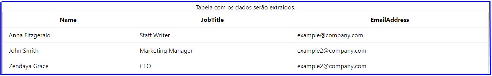
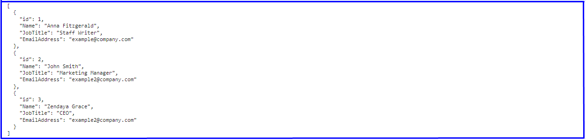

# Extraindo dados de tabela para JSON

Neste projeto, a proposta é extrair os dados da tabela e convertê-los para o formato JSON. Utilizaremos JavaScript para automatizar essa tarefa. Naturalmente, será necessário desenvolver um código para executar essa operação. A seguir, apresentarei os passos necessários para alcançar esse objetivo.

### Imagem da table HTML com os dados que serão extraidos.

A imagem acim mostra a tabela com as informações que será extraido através do script JavaScript.

#### Passo 1: Obtém uma referência para a tabela HTML com o ID 'myTable' e armazena na variável `tabela`.    
```javascript
let tabela = document.getElementById('myTable');
```
#### Passo 2: Crie e inicializa um array vazio que será usado para armazenar os dados da tabela.
```javascript
let dados = [];
```
#### Passo 3: Inicia um loop que percorre as linhas da tabela, começando do índice 1 para ignorar o cabeçalho.
```javascript
for (let i = 1; i < tabela.rows.length; i++) {
```
#### Passo 4: Obtém a referência para cada linha da tabela.
```javascript
let linha = tabela.rows[i];
```
#### Passo 5: Obtém as células (colunas) da linha.
```javascript
let colunas = linha.cells;
```
#### Passo 6: Crie e inicializa um objeto vazio que será usado para armazenar os dados da linha.
```javascript
let linhaDados = {};
```
#### Passo 7: Adiciona um elemento 'id' ao objeto criado no `Passo 6` com o número crescente como valor.
```javascript
linhaDados['id'] = i;
```
#### Passo 8: Inicia outro for loop para percorrer as células (colunas) da linha.
```javascript
for (let j = 0; j < colunas.length; j++) {
```
#### Passo 9: Usa o texto do cabeçalho da tabela como chave e o texto da célula como valor, adicionando esses pares chave-valor ao objeto criado no `Passo 6`.
```javascript
linhaDados[tabela.rows[0].cells[j].innerText] = colunas[j].innerText;
```
#### Passo 10: Adiciona o objeto [`criado no Passo 6`] ao array [`criado no Passo 2`].
```javascript
dados.push(linhaDados)
```

#### Passo 11: Fora do bloco For Loop coloque o `console.log()` para imprimir os dados.
```javascript
console.log(JSON.stringify(dados, null, 2))
```

### Função JSON.stringify:
    O JSON.stringify vai converter os dados recuperados para uma string JSON formatada.
        -   1º Argumento: Variável que contém os dados extraidos da tabela.
        -   2º Argumento: Ele é usado para alterar o comportamento da stringificação. Quando o valor é 'null' indica que nenhuma alteração especial deve ser feita.
        -   3º Argumento: Ele é utilizado para especificar o espaçamento na formatação da string JSON, para tornar-la mais legível.

### Imagem com o resultado.

A imagem acima, mostra o resultado do script.

<h1 align="center">💻 Desenvolvido Por: Gilberto Júnior</h1>